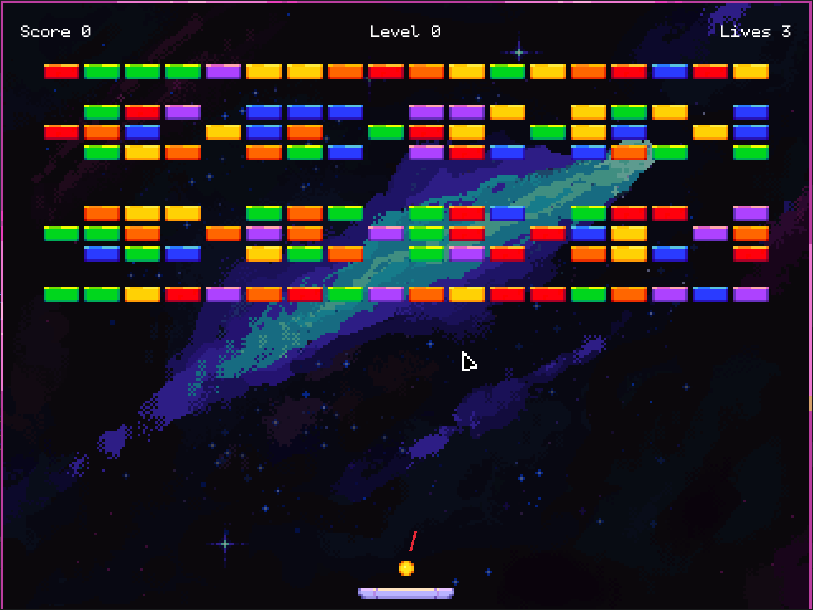
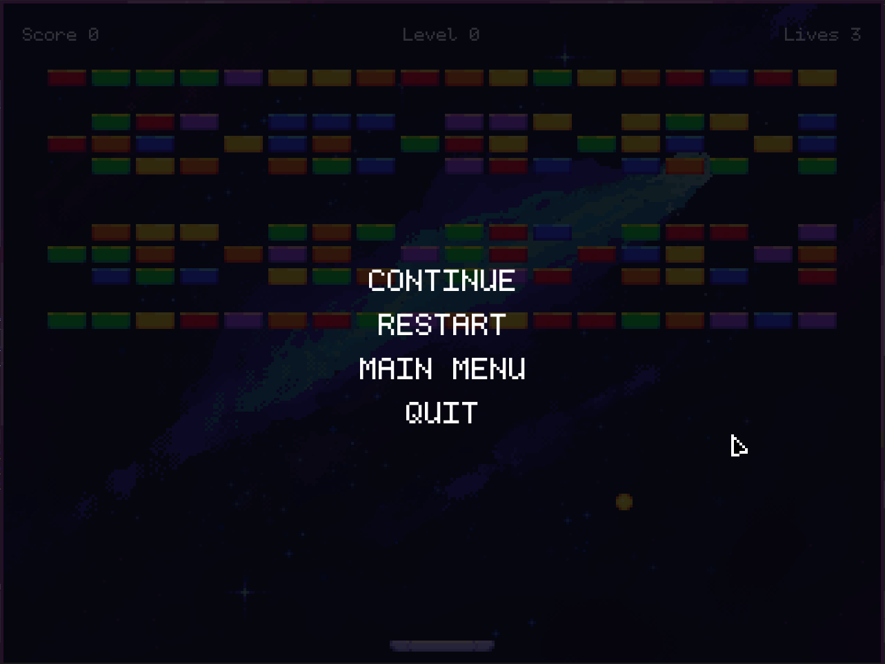

# 🧱 Breakout Clone (C++ & Raylib)

[](https://en.cppreference.com/w/cpp/23)
[](https://cmake.org/)
[](https://github.com/raysan5/raylib)

> ⚠️ This game is still a **work in progress**, but it's fully playable!

A simple clone of the classic **Breakout** game, made with **C++23**, **Raylib 5.5**, and **CMake**.  
Use `A` and `D` to move the paddle, **move the mouse** to aim the initial direction of the ball, and **left-click** to launch it.


<div align="center">
  
</div>

## 🎮 Controls

| Input         | Action                        |
|---------------|-------------------------------|
| `A`           | Move paddle left              |
| `D`           | Move paddle right             |
| Left Mouse    | Launch the ball               |
| Mouse Movement| Aim the initial direction     |

> ⚠️ The mouse is also used to interact with interface elements (menus, buttons, etc.) during the game.
---
## 🛠️ Build Instructions

This project uses **CMake** and automatically downloads Raylib via `FetchContent`.

### 📋 Requirements

- CMake ≥ 3.14  
- A C++ compiler with **C++23** support  
- Git (for cloning Raylib)

### 🔧 Build steps

```bash
# Clone the repository
git clone https://github.com/GabrielCASilva/Breakout.git
cd breakout-raylib

# Generate build files
cmake -B build -S .

# Build the game
cmake --build build

# Run the executable
./build/GameRaylib
```

## 📷 Screenshots

|  |  |
|--------------------------------------|--------------------------------------|

## 🖼️ Assets & Credits

- **Font**: [Kubasta](https://zichy.itch.io/kubasta) by Zichy
- **Artwork**: by **Ana Peixoto**
    - [Bluesky](https://bsky.app/profile/anapeixotoart.bsky.social)
    - [X / Twitter](https://x.com/anapeixotoart)

> Please support the artists by visiting their pages and checking out their work!